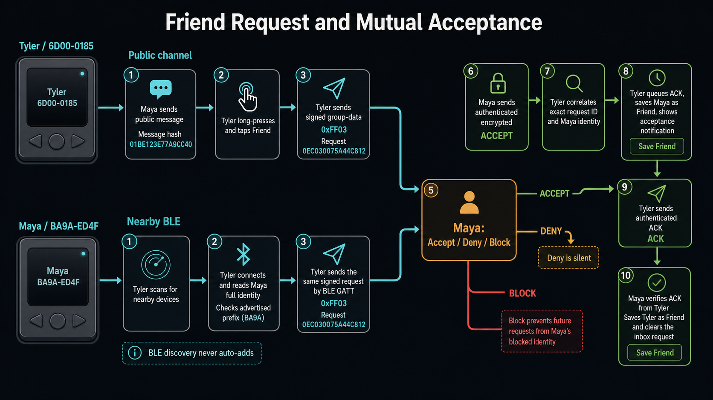
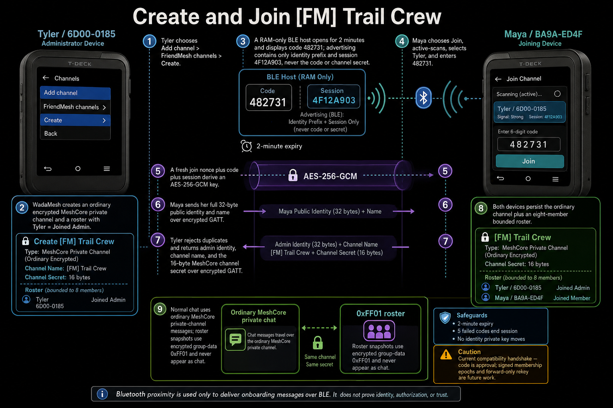
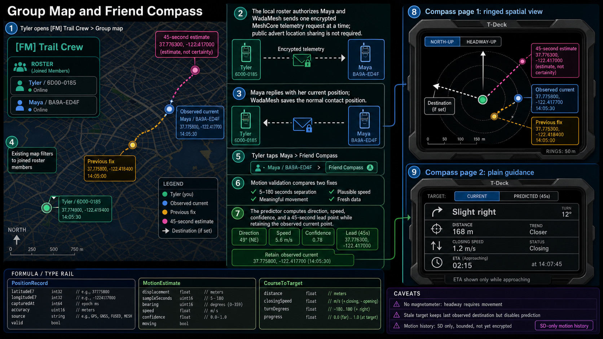
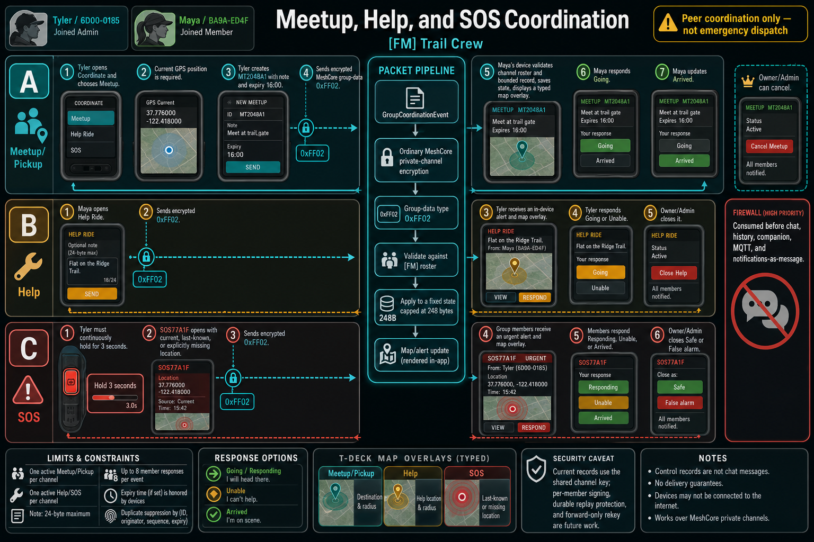
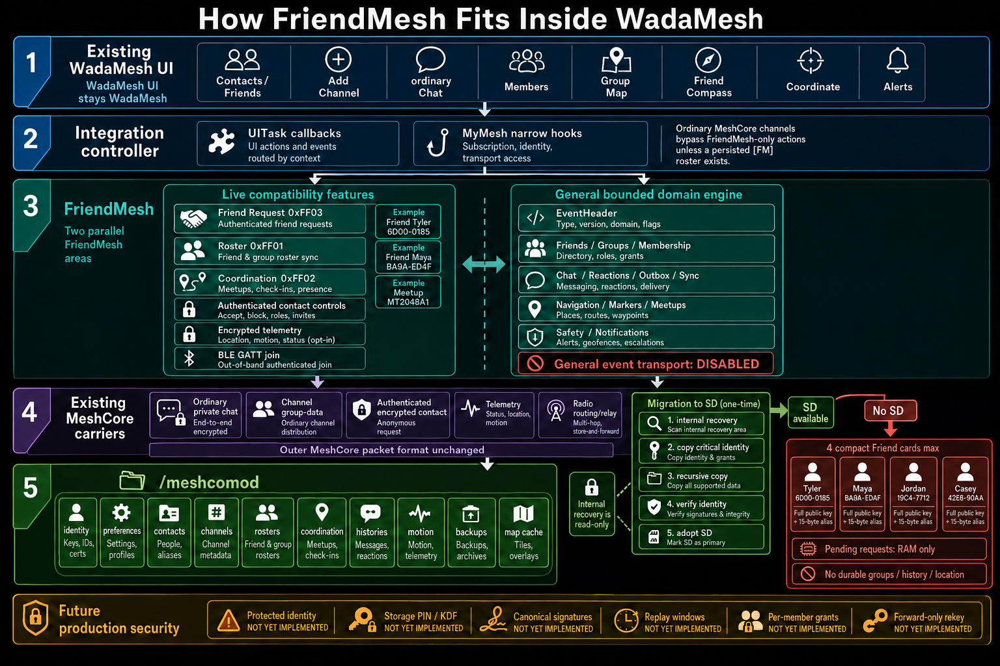

# FriendMesh OS Features, Types, and System Flows

This document explains the FriendMesh OS feature layer being developed inside WadaMesh. WadaMesh remains the host product, UI, and branding; FriendMesh adds bounded social, group, coordination, navigation, and persistence capabilities while reusing existing MeshCore carriers.

The current implementation target is the LilyGo T-Deck. Heltec support remains an architectural consideration, not a currently validated target.

## Type definitions and example dataset

The diagrams and examples below use one fictional scenario consistently:

```text
Device A
Name: Tyler
Public-key fingerprint: 6D00-0185

Device B
Name: Maya
Public-key fingerprint: BA9A-ED4F

Friend Request ID: 0EC030075A44C812
Target public-message hash: 01BE123E77A9CC40

FriendMesh group: [FM] Trail Crew
BLE join code: 482731
BLE session: 4F12A903

Tyler position:
37.774900, -122.419400 at 14:05:30

Maya previous position:
37.775300, -122.418400 at 14:05:00

Maya current position:
37.775800, -122.417700 at 14:05:30

Maya 45-second estimated position:
37.776300, -122.417000

Meetup ID: MT2048A1
Meetup location: 37.776000, -122.418000
Meetup note: "Meet at trail gate"

SOS ID: SOS77A1F
```

Fingerprints are shortened for display only. Identity decisions use complete keys.

The exact source definitions live under [`src/friendmesh`](src/friendmesh).

## Core identity and Friend records

```cpp
struct Id128 {
  uint8_t bytes[16];
};

struct IdentityReference {
  Id128 meshIdentity;
  Id128 signingIdentity;
};

struct FriendRecord {
  Id128 id;
  IdentityReference identity;
  IdentityReference previousIdentity;
  char label[33];
  VerificationState verification;
  bool blockedLocally;
  bool emergencyContactAllowed;
  uint32_t firstVerifiedAt;
  uint32_t lastAuthenticatedAt;
  uint8_t replacementCount;
};
```

Example:

```cpp
FriendRecord maya = {
  .id = id("friend-maya"),
  .identity = {
    .meshIdentity = id("BA9A-ED4F..."),
    .signingIdentity = {},  // production identity binding not implemented
  },
  .label = "Maya",
  .verification = VerificationState::Unverified,
  .blockedLocally = false,
  .emergencyContactAllowed = true,
};
```

The live lightweight Friend card is simpler: complete 32-byte MeshCore public key plus a private alias. The broader `FriendRecord` is the future-facing domain representation.

## Public and BLE Friend Request

```cpp
struct FriendRequestEnvelope {
  uint8_t flags;
  uint8_t requestId[8];
  uint8_t targetMessageHash[8];
  uint32_t createdAt;
  uint32_t expiresAt;
  uint8_t requesterPublicKey[32];
  char requesterName[24];
  uint8_t returnPathLength;
  uint8_t returnPath[14];
  uint8_t signature[64];
};
```

Example:

```cpp
FriendRequestEnvelope request = {
  .flags = 0,  // public-channel request
  .requestId = hex("0EC030075A44C812"),
  .targetMessageHash = hex("01BE123E77A9CC40"),
  .createdAt = 1785377100,
  .expiresAt = 1785463500,
  .requesterPublicKey = fullTylerPublicKey,
  .requesterName = "Tyler",
  .returnPathLength = 0,  // directly heard example
  .signature = signatureByTyler,
};
```

For BLE, `flags` includes `kFriendRequestFlagNearbyBle`, and the target hash is derived from Maya’s full public key rather than a public message.

## Friend acceptance, removal, and ACK

```cpp
enum class FriendLinkAction : uint8_t {
  Accepted = 1,
  Removed = 2,
  Acknowledged = 3,
};

struct FriendLinkEnvelope {
  FriendLinkAction action;
  uint8_t requestId[8];
  char peerName[24];
};
```

Examples:

```cpp
FriendLinkEnvelope accept = {
  .action = FriendLinkAction::Accepted,
  .requestId = hex("0EC030075A44C812"),
  .peerName = "Maya",
};

FriendLinkEnvelope ack = {
  .action = FriendLinkAction::Acknowledged,
  .requestId = hex("0EC030075A44C812"),
  .peerName = "Tyler",
};
```

## BLE presence and group provisioning

```cpp
struct BlePresencePeer {
  uint8_t pubKeyPrefix[6];
  int8_t rssi;
  bool joinHost;
  uint32_t joinSessionId;
  uint8_t addressType;
  char address[18];
  char name[16];
};

struct BleJoinProvision {
  uint8_t adminPubKey[32];
  char adminName[32];
  char channelName[32];
  uint8_t channelSecret[16];
};
```

Example:

```cpp
BlePresencePeer tylerHost = {
  .pubKeyPrefix = hex("6D000185A13C"),
  .rssi = -24,
  .joinHost = true,
  .joinSessionId = 0x4F12A903,
  .name = "Tyler",
};

BleJoinProvision trailCrew = {
  .adminPubKey = fullTylerPublicKey,
  .adminName = "Tyler",
  .channelName = "Trail Crew",
  .channelSecret = fictionalSixteenByteSecret,
};
```

The six-digit code is never stored in this provision and is never advertised.

## Live FriendMesh channel roster

```cpp
enum class ChannelRosterRole : uint8_t {
  Member = 0,
  Admin = 1,
};

enum class ChannelRosterState : uint8_t {
  Invited = 0,
  Joined = 1,
  InviteFailed = 2,
  Left = 3,
  Removed = 4,
};

struct ChannelRosterMember {
  uint8_t pubKeyPrefix[6];
  ChannelRosterRole role;
  ChannelRosterState state;
};

struct ChannelRoster {
  ChannelRosterMember members[8];
  uint8_t memberCount;
  bool rekeyRequired;
};
```

Example:

```cpp
ChannelRoster roster = {
  .members = {
    { hex("6D000185A13C"), ChannelRosterRole::Admin,
      ChannelRosterState::Joined },
    { hex("BA9AED4F27C1"), ChannelRosterRole::Member,
      ChannelRosterState::Joined },
  },
  .memberCount = 2,
  .rekeyRequired = false,
};
```

This is the live compatibility roster persisted alongside an ordinary MeshCore private channel.

## Broader group-domain type

```cpp
struct GroupMember {
  Id128 friendId;
  char alias[33];
  MemberRole role;
  MemberState state;
  uint16_t joinOrder;
  uint32_t admittedEpoch;
  uint32_t removedEpoch;
  uint32_t grantedEpoch;
  GrantState grantState;
  uint32_t lastAuthenticatedAt;
};

struct GroupRecord {
  Id128 id;
  char name[41];
  uint32_t membershipEpoch;
  uint32_t administrativeSequence;
  GroupSecurityState security;
  LocationVisibility locationVisibility;
  GroupMember members[8];
  uint8_t memberCount;
  uint32_t createdAt;
  uint32_t lastActivityAt;
};
```

This models the future signed membership/epoch system. It is not yet the live radio roster.

## Position and motion types

```cpp
struct PositionRecord {
  Id128 subjectId;
  int32_t latitudeE7;
  int32_t longitudeE7;
  uint32_t capturedAt;
  uint32_t receivedAt;
  uint16_t accuracyMeters;
  PositionSource source;
  bool valid;
  bool hiddenByPolicy;
};

struct MotionEstimate {
  PositionRecord predicted;
  uint32_t displacementMeters;
  uint32_t sampleSeconds;
  uint32_t horizonSeconds;
  uint16_t bearingDegrees;
  uint16_t speedCentimetersPerSecond;
  MotionConfidence confidence;
  bool samplesUsable;
  bool moving;
};

struct CourseToTargetEstimate {
  MotionEstimate motion;
  uint32_t distanceMeters;
  int32_t closingSpeedCentimetersPerSecond;
  int16_t turnDegrees;
  NavigationProgress progress;
  bool targetUsable;
  bool courseUsable;
};
```

Example current position:

```cpp
PositionRecord mayaCurrent = {
  .subjectId = id("friend-maya"),
  .latitudeE7 = 377758000,
  .longitudeE7 = -1224177000,
  .capturedAt = 1785377130,
  .receivedAt = 1785377132,
  .accuracyMeters = 8,
  .source = PositionSource::OnDeviceGps,
  .valid = true,
  .hiddenByPolicy = false,
};
```

Example motion result:

```cpp
MotionEstimate mayaMotion = {
  .predicted = position(37.776300, -122.417000),
  .sampleSeconds = 30,
  .horizonSeconds = 45,
  .bearingDegrees = 49,
  .speedCentimetersPerSecond = 560,
  .confidence = MotionConfidence::Good,
  .samplesUsable = true,
  .moving = true,
};
```

The numbers in generated images are explanatory. These C++ definitions are authoritative.

## Meetup, Help, and SOS coordination types

```cpp
enum class GroupCoordinationAction : uint8_t {
  SetMeetup,
  CancelMeetup,
  MeetupResponse,
  OpenIncident,
  IncidentResponse,
  CloseIncident,
};

enum class GroupCoordinationKind : uint8_t {
  Meetup,
  Pickup,
  HelpRide,
  HelpLost,
  HelpEquipment,
  HelpContact,
  Sos,
};

enum class GroupCoordinationResponse : uint8_t {
  None,
  Going,
  Unable,
  Arrived,
};

struct GroupCoordinationItem {
  uint8_t objectId[8];
  uint8_t ownerPrefix[6];
  GroupCoordinationKind kind;
  GroupCoordinationStatus status;
  uint32_t createdAt;
  uint32_t updatedAt;
  uint32_t expiresAt;
  int32_t latitudeE6;
  int32_t longitudeE6;
  bool hasLocation;
  char note[25];
};

struct GroupCoordinationEvent {
  GroupCoordinationAction action;
  GroupCoordinationItem item;
  GroupCoordinationResponse response;
};
```

Example:

```cpp
GroupCoordinationEvent meetup = {
  .action = GroupCoordinationAction::SetMeetup,
  .item = {
    .objectId = bytes("MT2048A1"),
    .ownerPrefix = hex("6D000185A13C"),
    .kind = GroupCoordinationKind::Meetup,
    .status = GroupCoordinationStatus::Active,
    .expiresAt = epochAt1600,
    .latitudeE6 = 37776000,
    .longitudeE6 = -122418000,
    .hasLocation = true,
    .note = "Meet at trail gate",
  },
  .response = GroupCoordinationResponse::None,
};
```

## General EventHeader and outbox

```cpp
struct EventHeader {
  Id128 eventId;
  Id128 groupId;
  Id128 senderId;
  EventType type;
  EventPriority priority;
  uint32_t membershipEpoch;
  uint32_t senderSequence;
  uint32_t createdAt;
  uint32_t expiresAt;
  uint32_t payloadHandle;
  uint32_t payloadLength;
  uint8_t payloadHash[32];
};

enum class OutboxState : uint8_t {
  Empty,
  Queued,
  Transmitting,
  RelayedOrObserved,
  Delivered,
  RetryWaiting,
  Failed,
  Expired,
  Cancelled,
};

struct OutboxEntry {
  EventHeader event;
  OutboxState state;
  ResultCode lastResult;
  uint32_t nextAttemptAt;
  uint16_t attemptCount;
  bool persistenceConfirmed;
};
```

`RelayedOrObserved` deliberately does not mean the final recipient received it.

## Chat and incident types

```cpp
struct ChatRecord {
  Id128 eventId;
  Id128 groupId;
  Id128 senderId;
  uint32_t textHandle;
  uint32_t textLength;
  uint32_t originalCreatedAt;
  uint32_t locallyReceivedAt;
  DeliveryState delivery;
  bool delayed;
  bool senderClockUntrusted;
};

struct IncidentRecord {
  Id128 incidentId;
  Id128 originatorId;
  IncidentKind kind;
  IncidentState state;
  PositionRecord position;
  uint32_t openedAt;
  uint32_t updatedAt;
  uint32_t closedAt;
  uint32_t detailHandle;
  uint16_t detailLength;
  uint8_t deliveredCount;
  uint8_t respondingCount;
  bool publicFallbackApproved;
  bool persistenceFailed;
};
```

These are implemented in the general domain engine. They do not yet replace ordinary WadaMesh/MeshCore chat.

# Generated flow diagrams

## Friend Request and mutual acceptance



Both public-channel and nearby BLE requests converge on the same approval and three-message completion sequence:

```text
REQUEST → ACCEPT → ACK
```

The requester saves the recipient after receiving ACCEPT and successfully queuing ACK. The recipient saves the requester only after receiving that ACK.

## BLE group creation and joining



The group remains an ordinary MeshCore private channel. BLE transfers its existing channel name and symmetric secret through a short-lived AES-256-GCM exchange.

## Group Map and Friend Compass



The image’s type rail uses visual shorthand. The exact integer and enum types are the definitions above.

## Meetup, Help, and SOS



These use encrypted binary group-data records and never enter the channel-text pipeline.

## System architecture and storage



The key architectural division is between live compatibility features and the general bounded domain engine whose production event transport remains disabled.

# Feature explanations and three useful examples each

## 1. Curated Friends list

This creates a user-controlled social directory over WadaMesh’s much larger MeshCore contact table.

It uses full public keys for identity and private local aliases for presentation. Friends survive later adverts or contact-list cleanup because the social relationship is distinct from network discovery.

Good for:

1. Keeping five actual friends visible while hundreds of repeaters and discovered nodes remain outside the Friends view.
2. Giving two people named “Alex” different private aliases and distinguishing them by fingerprint.
3. Preserving a trusted contact relationship while still allowing the underlying MeshCore route/contact data to refresh normally.

## 2. Public-channel Friend Requests

A received public message becomes the targeting anchor. The request carries the message hash, requester identity, signature, expiry, and return path.

Good for:

1. Adding someone met through a regional public channel hundreds of miles away.
2. Avoiding dependence on a recent public advert.
3. Ensuring a request associated with Maya’s message enters Maya’s inbox rather than every channel member’s inbox.

## 3. Nearby BLE Friend Requests

BLE discovers nearby FriendMesh devices and delivers the initial signed request. Discovery never automatically adds someone.

Good for:

1. Adding someone standing beside you without waiting for a LoRa advert.
2. Exchanging a request at an event where the public MeshCore channel is crowded.
3. Verifying that the complete GATT identity matches the publicly advertised prefix before showing the request.

## 4. Accept, deny, block, and reciprocal removal

Acceptance is ACK-gated. Denial is silent. Blocking prevents future requests from the same full identity. Removal quietly attempts to remove the relationship on both devices.

Good for:

1. Preventing one-sided friendship caused by an acceptance packet the requester never received.
2. Denying an unwanted request without sending the requester a negative notification.
3. Removing a former Friend while preserving their ordinary MeshCore contact and route information.

## 5. FriendMesh private groups

A FriendMesh group wraps roster and coordination metadata around an ordinary MeshCore private channel.

Good for:

1. Creating a private hiking group without inventing a second chat protocol.
2. Giving an existing friend group a Members view and Group Map.
3. Keeping normal public, hashtag, and ordinary private channels free of FriendMesh-specific actions.

## 6. Six-digit BLE group joining

The administrator displays a short-lived code, the guest scans for the host, and AES-256-GCM protects the GATT provisioning exchange.

Good for:

1. Adding people gathered in the same room without typing a 16-byte channel secret.
2. Creating a group when neither device has previously received the other’s advert.
3. Preventing accidental joins by someone who can see the BLE host but cannot see the administrator’s displayed code.

Current limitation: knowledge of the code is the approval step. A separate signed administrator approval is future work.

## 7. Members and roster state

The roster tracks joined, invited, failed, left, and removed members plus administrator/member roles.

Good for:

1. Seeing whether Maya actually completed joining instead of merely receiving an invitation.
2. Preventing the administrator from repeatedly inviting someone already in the group.
3. Showing `rekey required` after removal instead of falsely claiming the old channel key is revoked.

## 8. Administrator disband

Disband attempts removal notices, deletes the administrator’s channel, and reports unreachable members.

Good for:

1. Ending a temporary event group after the event.
2. Removing an accidentally created FriendMesh group.
3. Giving the administrator an explicit destructive action with confirmation rather than leaving orphaned roster metadata.

It is best-effort until durable delivery and signed membership events exist.

## 9. Group Map

Group Map filters the existing WadaMesh map to joined members and polls their locations sequentially through encrypted telemetry.

Good for:

1. Seeing only the hiking group rather than every contact with coordinates.
2. Refreshing member locations without requiring public advert-location sharing.
3. Locating the next person to pick up without creating a permanent tracking broadcast.

## 10. Friend Compass

Friend Compass turns one group member’s position into a two-page navigation tool. It provides distance, bearing, motion prediction, plain-language turning guidance, and progress.

Good for:

1. Walking toward a friend inside a large festival or park.
2. Seeing that a friend is moving northeast and using a conservative lead point rather than chasing an old coordinate.
3. Recognizing that you are moving farther away even when the raw distance number is difficult to interpret while walking.

It uses GPS course over ground, not a magnetometer. Headway requires movement.

## 11. Motion prediction and headway

Two bounded fixes produce displacement, speed, bearing, confidence, and a 45-second estimated point. Two local fixes produce the user’s course relative to the target.

Good for:

1. Estimating which trail junction a moving friend is approaching.
2. Showing “slight right” instead of an abstract `98°` instruction.
3. Calculating ETA only when the user is genuinely closing the distance.

Prediction is not guaranteed. Stale or implausible samples fall back to the observed coordinate.

## 12. Compass-start notice

Starting Friend Compass sends one authenticated targeted notice after both positions are available.

Good for:

1. Letting Maya know Tyler has started walking toward her.
2. Showing Maya the current straight-line separation without adding a chat bubble.
3. Avoiding silent location-seeking behavior inside a FriendMesh group.

## 13. Meetup and pickup coordination

One meetup or pickup may be active per FriendMesh channel, with position, note, expiry, and bounded responses.

Good for:

1. Marking a trail gate and letting members answer Going or Arrived.
2. Setting a vehicle pickup point after an event.
3. Moving group coordination out of rapidly scrolling chat while keeping it visible on the map.

## 14. Help coordination

Help records represent structured peer assistance rather than an ambiguous chat message.

Good for:

1. Asking for a ride and seeing who is responding.
2. Reporting that someone is lost and sharing the current or last-known position.
3. Requesting equipment assistance while allowing members to answer Going or Unable.

## 15. SOS coordination

SOS requires a continuous three-second hold and creates a high-priority group incident with current, last-known, or missing-location state.

Good for:

1. Alerting a hiking group after an injury.
2. Requesting immediate peer assistance when someone feels unsafe.
3. Tracking Responding, Unable, and Arrived states during a group incident.

It is not guaranteed emergency dispatch and must not be treated as a replacement for emergency services.

## 16. Typed binary control records

Roster, coordination, and Friend Request data use reserved group-data types rather than visible chat text:

```text
0xFF01 — roster
0xFF02 — meetup/Help/SOS coordination
0xFF03 — Friend Request
```

Good for:

1. Preventing binary records such as `FMRS1` from appearing as chat.
2. Updating map and member state without manufacturing fake user messages.
3. Allowing stock software to ignore unknown application records while ordinary channel text remains unchanged.

Full stock and multi-hop compatibility still requires physical qualification.

## 17. Chat, history, reaction, and synchronization engine

This bounded domain engine models messages, replies, reactions, tombstones, unread/mute state, outbox retries, fragmentation, missing ranges, receipts, and conflict quarantine.

Good for:

1. Reconstructing missed group events when a device has been offline.
2. Distinguishing “heard relayed” from actual end-recipient delivery.
3. Preventing two conflicting events with the same sender sequence from silently overwriting one another.

This is host-tested foundation code, not the current live WadaMesh chat replacement.

## 18. Membership and rekey domain engine

The membership engine models invitations, approval, rejection, expiry, removal, identity replacement, administration transfer, succession, grants, and membership epochs.

Good for:

1. Requiring all remaining members to receive a new epoch grant after someone is removed.
2. Transferring administration when the original administrator leaves.
3. Handling a member’s identity replacement without silently treating an unrelated identity as the same person.

Production signing, grants, and rekey transport remain unimplemented.

## 19. SD-first persistence

Growing FriendMesh and WadaMesh data is kept under `/meshcomod` on SD. Internal recovery data remains readable but is not used as an unrestricted fallback store.

Good for:

1. Keeping chat, maps, motion history, and coordination state off constrained internal flash.
2. Preserving existing map tiles while migrating identity and settings.
3. Recovering from an interrupted migration without deleting the internal source.

## 20. Four-Friend no-SD fallback

Without SD, internal storage may hold only four compact accepted Friend cards. Groups, histories, requests, locations, and coordination do not gain equivalent fallbacks.

Good for:

1. Retaining a few essential identities after an SD failure.
2. Allowing basic Friend visibility while protecting internal flash from growing datasets.
3. Merging emergency Friend cards back into the SD-backed store when storage returns.

## 21. WadaMesh-preserving integration

FriendMesh is integrated through narrow callbacks and existing screens instead of replacing the application.

Good for:

1. Retaining ordinary WadaMesh chat, maps, OTA, companion connections, and settings.
2. Making FriendMesh optional for users who only want ordinary MeshCore.
3. Preserving a shared architecture that can later support Heltec without making Heltec the current implementation target.

# Current security boundary

Already used:

- MeshCore private-channel encryption
- MeshCore authenticated/encrypted contact carriers
- Signed Friend Request envelopes
- AES-256-GCM BLE group provisioning
- Expiry, retry, bounds, deduplication, confirmation, and block controls
- No transfer of identity private keys

Still future work:

- Protected FriendMesh identity
- Independent storage PIN and KDF
- Device-bound secret wrapping
- Authenticated storage journals
- Canonical signatures for every event
- Durable replay windows
- Transcript-bound administrator approval
- Per-member group-key grants
- Forward-only rekey
- Protected motion history
- Privacy-preserving rotating BLE identifiers
- Sensitive screenshot/remote-surface masking

# Generated-image details

These were created with the built-in image-generation tool in `infographic-diagram` mode. The final prompt set was:

1. Public-channel and BLE Friend Requests converging into the ACK-gated friendship transaction.
2. BLE creation and joining of `[FM] Trail Crew` using code `482731`, session `4F12A903`, and AES-256-GCM.
3. Group Map, two-fix motion estimation, and the two-page Friend Compass.
4. Meetup, Help, and SOS coordination through `0xFF02`.
5. Layered WadaMesh/FriendMesh/MeshCore/storage architecture, followed by a correction limiting no-SD storage to four Friend cards.

Final generated files:

- `docs/images/friendmesh/friend-request-flow.png`
- `docs/images/friendmesh/ble-group-join-flow.png`
- `docs/images/friendmesh/group-map-friend-compass-flow.png`
- `docs/images/friendmesh/meetup-help-sos-flow.png`
- `docs/images/friendmesh/system-architecture-storage.png`
